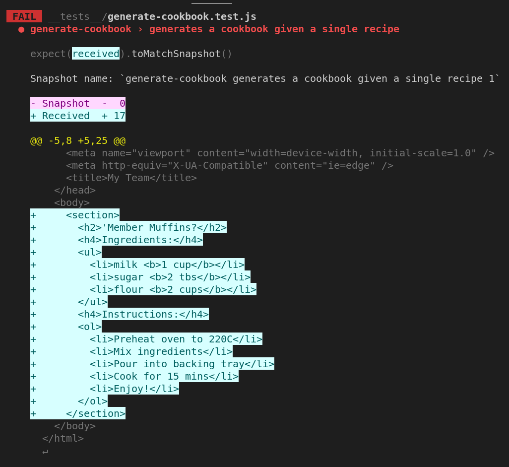

# Whipping up a Cookbook

## Big Picture: Publishing the Cookbook

Specify the behaviour of what you are building **before** you build it.

## Step 1: A cookbook with no recipes

### Red `generateCookbook` - Write a "failing" test: "generates an empty cookbook when there are no recipes"

```javascript
const generateCookbook = require("../lib/generate-cookbook.js");

describe("generate-cookbook", () => {
  it("generates an empty cookbook when there are no recipes", () => {
    expect(generateCookbook([])).toMatchSnapshot();
  });

});
```

### Green `generateCookbook` - Make the test pass: "generates an empty cookbook when there are no recipes"

Build **only** enough to make your first test pass!

```javascript
const prettier = require("prettier");

//Hint: Write tests for generateCookbook - how should this method behave?
// Think about the inputs and outputs of the method - this will form the basis of your test cases.
function generateCookbook() {
  // Calling `prettier.format("<html>Your HTML String</html>",{parser:"html"})` means that your cookbook's HTML will always be formatted consistently.
  // This will prevent your snapshots from failing to match simply due to formatting differences between the HTML produced by this function and the HTML  stored in the snapshot files.
  const formattedCookbookHTML =  prettier.format(
    `<!DOCTYPE html>
    <html lang="en">
    <head>
        <meta charset="UTF-8" />
        <meta name="viewport" content="width=device-width, initial-scale=1.0" />
        <meta http-equiv="X-UA-Compatible" content="ie=edge" />
        <title>My <em>Delish</em> Recipes</title>
    </head>
    <body>
    </body>
    </html>`,
    { parser: "html" }
  );

  return formattedCookbookHTML;
}
module.exports = generateRecipeCards;
```

Running the updated `generate-cookbook` tests will result the snapshot file `__tests__/__snapshots__/generate-cookbook.test.js.snap` being created. Looking inside the file, we can see that a new snapshot was created for the `"generates an empty cookbook when there are no recipes"` test case. Inspecting the snapshot content, we see the cookbook HTML without any recipes in the body - this is exactly what we would expect, given that we have no recipes!

```javascript
// Jest Snapshot v1, https://goo.gl/fbAQLP

exports[`generate-cookbook generates an empty cookbook when there are no recipes 1`] = `
"<!DOCTYPE html>
<html lang=\\"en\\">
  <head>
    <meta charset=\\"UTF-8\\" />
    <meta name=\\"viewport\\" content=\\"width=device-width, initial-scale=1.0\\" />
    <meta http-equiv=\\"X-UA-Compatible\\" content=\\"ie=edge\\" />
    <title>My Team</title>
  </head>
  <body></body>
</html>
"
`;
```

### Refactor `generateCookbook`

Since we know are going to have to generate a cookbook with actual recipes (what use is an empty cookbook after all?) - we can take some time to introduce a function `generateRecipeCards` that creates our recipe cards from a list of recipes. In the first instance, this function will return an empty string when given a list of recipes. Later on we'll enhance it, so that it actually returns recipe cards when the list of recipes is non-empty.

Before we implement `generateRecipeCards` we *must* specify its behaviour. We'll do this using a test:

#### Red `generateRecipeCards` - Write a failing test "generates an empty string when given an empty list of recipes"

```javascript
describe("generate-recipe-cards", () => {
  it("generates an empty string when given an empty list of recipes", () => {
    const emptyListOfRecipes = [];
    const actual = generateRecipeCards(emptyListOfRecipes);
    const expected = `
    `;
    expect(actual).toEqual(prettier.format(expected, { parser: "html" }));
  });
}
```

#### Green `generateRecipeCards` - Make the test pass: "generates an empty string when given an empty list of recipes"

```javascript
function generateRecipeCards() {
  return "";
}
module.exports = generateRecipeCards;
```

### Refactor `generateCookbook` to use `generateRecipeCards`

```javascript
const prettier = require("prettier");
const generateRecipeCards = require('../lib/generate-recipe-cards.js');

.
function generateCookbook(recipes) {
  const formattedCookbookHTML =  prettier.format(
    `<!DOCTYPE html>
    <html lang="en">
    <head>
        <meta charset="UTF-8" />
        <meta name="viewport" content="width=device-width, initial-scale=1.0" />
        <meta http-equiv="X-UA-Compatible" content="ie=edge" />
        <title>My <em>Delish</em> Recipes</title>
    </head>
    <body>
      ${generateRecipeCards(recipes)}
    </body>
    </html>`,
    { parser: "html" }
  );

  return formattedCookbookHTML;
}
module.exports = generateRecipeCards;
```

## Step 2: A cookbook with 1 recipe

Once you've got your first test for a cookbook with no recipes passing, it's time to think about generating a cookbook with some actual recipes in it! To do this, we need to decide what a recipe actually looks like:

```javascript
  const memberMuffinsRecipe = {
    name: "'Member Muffins?",
    ingredients: [
      { ingredient: "milk", quantity: "1 cup" },
      { ingredient: "sugar", quantity: "2 tbs" },
      { ingredient: "flour", quantity: "2 cups" },
    ],
    instructions: [
      "Preheat oven to 220C",
      "Mix ingredients",
      "Pour into backing tray",
      "Cook for 15 mins",
      "Enjoy!",
    ],
  };
```

### Red `generateCookbook` - Add a failing test: "generates a cookbook given a single recipe"

Coming back to the `generateCookbook` tests, add a test to verify that produce a cookbook with a single recipe card when given a single recipe.

```javascript
const generateCookbook = require("../lib/generate-cookbook.js");

describe("generate-cookbook", () => {

  const memberMuffinsRecipe = {
    name: "'Member Muffins?",
    ingredients: [
      { ingredient: "milk", quantity: "1 cup" },
      { ingredient: "sugar", quantity: "2 tbs" },
      { ingredient: "flour", quantity: "2 cups" },
    ],
    instructions: [
      "Preheat oven to 220C",
      "Mix ingredients",
      "Pour into backing tray",
      "Cook for 15 mins",
      "Enjoy!",
    ],
  };

  it("generates an empty cookbook when there are no recipes", () => {
    expect(generateCookbook([])).toMatchSnapshot();
  });

  it("generates a cookbook given a single recipe", () => {
    expect(generateCookbook([memberMuffinsRecipe])).toMatchSnapshot();
  });

});
```

Running the updated `generate-cookbook` tests will result in a new snapshot being created for the `"generates a cookbook given a single recipe"` test case. Inspecting the snapshot file, you'll notice that it *does not* in fact contain _any_ recipes in the body of the cookbook HTML:

```javascript
exports[`generate-cookbook generates a cookbook given a single recipe 1`] = `
"<!DOCTYPE html>
<html lang=\\"en\\">
  <head>
    <meta charset=\\"UTF-8\\" />
    <meta name=\\"viewport\\" content=\\"width=device-width, initial-scale=1.0\\" />
    <meta http-equiv=\\"X-UA-Compatible\\" content=\\"ie=edge\\" />
    <title>My Team</title>
  </head>
  <body></body>
</html>
"
`;
```

This is clearly a problem that `generateRecipeCards` needs to handle, since it's responsible for generating all the recipe cards on behalf of `generateCookbook`. Let's write a test for this:

#### Red `generateRecipeCards` - Write a failing test: "generates 1 recipe card when given a list containing a single recipe"

```javascript
const generateRecipeCards = require("../lib/generate-recipe-cards.js");
const prettier = require("prettier");

describe("generate-recipe-cards", () => {

const memberMuffinsRecipe = {
    name: "'Member Muffins?",
    ingredients: [
      { ingredient: "milk", quantity: "1 cup" },
      { ingredient: "sugar", quantity: "2 tbs" },
      { ingredient: "flour", quantity: "2 cups" },
    ],
    instructions: [
      "Preheat oven to 220C",
      "Mix ingredients",
      "Pour into backing tray",
      "Cook for 15 mins",
      "Enjoy!",
    ],
  };

  it("generates an empty string when given an empty list of recipes", () => {
    const emptyListOfRecipes = [];
    const actual = generateRecipeCards(emptyListOfRecipes);
    const expected = `
    `;
    expect(actual).toEqual(prettier.format(expected, { parser: "html" }));
  });

  it("generates 1 recipe card when given a list containing a single recipe", () => {
    const actual = generateRecipeCards([memberMuffinsRecipe]);
    const expected = `
    <section>
      <h2>Member Muffins?</h2>
      <h4>Ingredients:</h4>
      <ul>
        <li>milk <b>1 cup</b></li>
        <li>sugar <b>2 tbs</b></li>
        <li>flour <b>2 cups</b></li>
      </ul>
      <h4>Instructions:</h4>
      <ol>
        <li>Preheat oven to 220C</li>
        <li>Mix ingredients</li>
        <li>Pour into baking tray</li>
        <li>Cook for 15 mins</li>
        <li>Enjoy!</li>
      </ol>
    </section>
    `;
    expect(actual).toEqual(prettier.format(expected, { parser: "html" }));
  });
```

#### Green `generateRecipeCards` - Make the test pass: "generates 1 recipe card when given a list containing a single recipe"

Before we jump into building `generateRecipeCards`, we should think about how we are to generate a single recipe card. Instead of putting the responsibility of generating a single recipe card onto `generateRecipeCards`, we should employ a seperate function ``generateRecipeCard` to handle this job. Let's write a test for `generateRecipeCard` before we do anything else:

##### Red `generateRecipeCard` - Write a failing test: "generates an empty string when no recipe is provided"

```javascript
const generateRecipeCard = require("../lib/generate-recipe-card.js");
const prettier = require("prettier");

describe("generate-recipe-card", () => {
  it("generates an empty string when no recipe is provided", () => {
    const actual = generateRecipeCard();
    const expected = `
    `;
    expect(actual).toEqual(prettier.format(expected, { parser: "html" }));
  });
}
```

##### Green `generateRecipeCard` - Make the test pass: "generates an empty string when no recipe is provided"

```javascript
const prettier = require("prettier");

function generateRecipeCard(recipe) {
  if (recipe === undefined) return "";
}
```

##### Red `generateRecipeCard` - Write a failing test: "generates an empty recipe card when given a recipe with no name, ingredients or instructions"

```javascript
const generateRecipeCard = require("../lib/generate-recipe-card.js");
const prettier = require("prettier");

describe("generate-recipe-card", () => {
  
  it("generates an empty string when no recipe is provided", () => {
    const actual = generateRecipeCard();
    const expected = `
    `;
    expect(actual).toEqual(prettier.format(expected, { parser: "html" }));
  });

  it("generates an empty recipe card when given a recipe with no name, ingredients or instructions", () => {
    const emptyRecipe = {};
    const actual = generateRecipeCard(emptyRecipe);
    const expected = `
    <section>
      <h2></h2>
      <h4>Ingredients:</h4>
      <ul></ul>
      <h4>Instructions:</h4>
      <ol></ol>
    </section>
    `;
    expect(actual).toEqual(prettier.format(expected, { parser: "html" }));
  });
});
```

##### Green `generateRecipeCard` - Make the test pass: "generates an empty recipe card when given a recipe with no name, ingredients or instructions"

```javascript
const prettier = require("prettier");

function generateRecipeCard(recipe) {
  if (recipe === undefined) return "";
  const recipeCard = prettier.format(
    `
  <section>
    <h2></h2>
      <h4>Ingredients:</h4>
      <ul></ul>
      <h4>Instructions:</h4>
      <ol></ol>
  </section>
  `,
    {
      parser: "html",
    }
  );
  return recipeCard;
}
module.exports = generateRecipeCard;
```

##### Red `generateRecipeCard` - Write a failing test: "generates a recipe card with a name, ingredients and instructions"

```javascript
const generateRecipeCard = require("../lib/generate-recipe-card.js");
const prettier = require("prettier");

describe("generate-recipe-card", () => {
  const memberMuffinsRecipe = {
    name: "Member Muffins?",
    ingredients: [
      { name: "milk", quantity: "1 cup" },
      { name: "sugar", quantity: "2 tbs" },
      { name: "flour", quantity: "2 cups" },
    ],
    instructions: [
      "Preheat oven to 220C",
      "Mix ingredients",
      "Pour into baking tray",
      "Cook for 15 mins",
      "Enjoy!",
    ],
  };

  it("generates an empty string when no recipe is provided", () => {
    const actual = generateRecipeCard();
    const expected = `
    `;
    expect(actual).toEqual(prettier.format(expected, { parser: "html" }));
  });

  it("generates an empty recipe card when given a recipe with no name, ingredients or instructions", () => {
    const emptyRecipe = {};
    const actual = generateRecipeCard(emptyRecipe);
    const expected = `
    <section>
      <h2></h2>
      <h4>Ingredients:</h4>
      <ul></ul>
      <h4>Instructions:</h4>
      <ol></ol>
    </section>
    `;
    expect(actual).toEqual(prettier.format(expected, { parser: "html" }));
  });

  it("generates a recipe card with a name, ingredients and instructions", () => {
    const actual = generateRecipeCard(memberMuffinsRecipe);
    const expected = `
    <section>
      <h2>Member Muffins?</h2>
      <h4>Ingredients:</h4>
      <ul>
        <li>milk <b>1 cup</b></li>
        <li>sugar <b>2 tbs</b></li>
        <li>flour <b>2 cups</b></li>
      </ul>
      <h4>Instructions:</h4>
      <ol>
        <li>Preheat oven to 220C</li>
        <li>Mix ingredients</li>
        <li>Pour into baking tray</li>
        <li>Cook for 15 mins</li>
        <li>Enjoy!</li>
      </ol>
    </section>
    `;
    expect(actual).toEqual(prettier.format(expected, { parser: "html" }));
  });
});
```

##### Green `generateRecipeCard` - Make the test pass: "generates a recipe card with a name, ingredients and instructions"

```javascript
const prettier = require("prettier");

function generateRecipeCard(recipe) {
  if (recipe === undefined) return "";
  const { name = "", ingredients = [], instructions = [] } = recipe;
  const recipeCard = prettier.format(
    `
  <section>
    <h2>${name}</h2>
      <h4>Ingredients:</h4>
      <ul>
      ${ingredients
        .map(
          (ingredient) =>
            `<li>${ingredient.name} <b>${ingredient.quantity}</b></li>`
        )
        .join("")}
      </ul>
      <h4>Instructions:</h4>
      <ol>
      ${instructions.map((instruction) => `<li>${instruction}</li>`).join("")}
      </ol>
  </section>
  `,
    {
      parser: "html",
    }
  );
  return recipeCard;
}
module.exports = generateRecipeCard;

```

#### Green `generateRecipeCards` - Make the test pass: "generates 1 recipe card when given a list containing a single recipe"

```javascript
const generateRecipeCard = require("./generate-recipe-card.js");
function generateRecipeCards(recipes = []) {
  const recipeCards = recipes.map(generateRecipeCard);
  return recipeCards.join("");
}
module.exports = generateRecipeCards;
```

### Green `genereateCookbook` - Make the test pass: "generates a cookbook given a single recipe"

Now that `generateRecipeCards` can produce a recipe card when given a single recipe, our test in `genereateCookbook` will now fail!



This is because our previous snapshot `generate-cookbook generates a cookbook given a single recipe 1`, which has an empty body no longer matches the output produced by `generateCookbook`:

```javascript
// Jest Snapshot v1, https://goo.gl/fbAQLP

exports[`generate-cookbook generates a cookbook given a single recipe 1`] = `
"<!DOCTYPE html>
<html lang=\\"en\\">
  <head>
    <meta charset=\\"UTF-8\\" />
    <meta name=\\"viewport\\" content=\\"width=device-width, initial-scale=1.0\\" />
    <meta http-equiv=\\"X-UA-Compatible\\" content=\\"ie=edge\\" />
    <title>My Team</title>
  </head>
  <body></body>
</html>
"
`;

exports[`generate-cookbook generates an empty cookbook when there are no recipes 1`] = `
"<!DOCTYPE html>
<html lang=\\"en\\">
  <head>
    <meta charset=\\"UTF-8\\" />
    <meta name=\\"viewport\\" content=\\"width=device-width, initial-scale=1.0\\" />
    <meta http-equiv=\\"X-UA-Compatible\\" content=\\"ie=edge\\" />
    <title>My Team</title>
  </head>
  <body></body>
</html>
"
`;
```

In this case, the output in the snapshot should be replaced with the updated output from `generateCookbook`. We can update the snapshot file contents by simply hitting the `u` key in the terminal where our tests are running.
